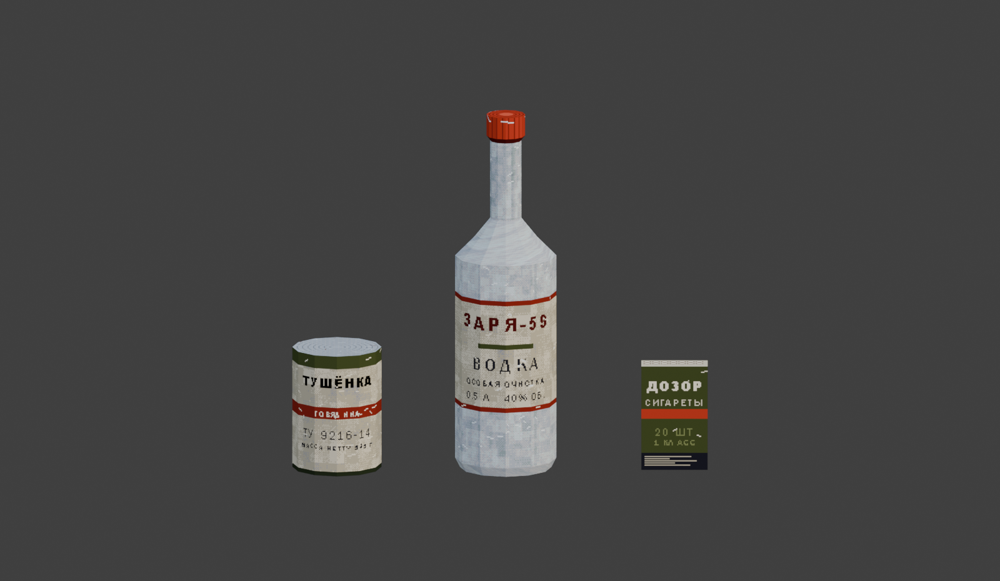

# psx-assets-blender

Game-ready PS1-era props for Blender, and the tooling that keeps them looking
like one coherent set.



Post-soviet grime: canned rations, cheap vodka, state-issue cigarettes. Built
for survival horror and boomer-shooter projects that want the real thing rather
than a low-poly model with a blurry texture stretched over it.

### Consumables

| Prop | Tris | Texture |
|---|---|---|
| `SM_Can_Food_01` | 48 | 256x256 |
| `SM_Bottle_Vodka_01` | 264 | 256x512 |
| `SM_Pack_Cigarettes_01` | 12 | 256x256 |

### Bunker set

| Prop | Tris | Atlas | Tier |
|---|---|---|---|
| `SM_Locker_Steel_01` | 48 | 512x1024 | furniture |
| `SM_Cabinet_Wall_01` | 24 | 512x512 | furniture |
| `SM_Cabinet_Filing_01` | 48 | 512x512 | furniture |
| `SM_Shelf_Steel_01` | 96 | 512x512 | furniture |
| `SM_Crate_Ammo_01` | 24 | 256x256 | furniture |
| `SM_Crate_Wood_01` | 36 | 512x512 | furniture |
| `SM_Barrel_Steel_01` | 144 | 512x512 | furniture |
| `SM_Table_Steel_01` | 72 | 512x512 | furniture |
| `SM_Desk_Wood_01` | 60 | 512x512 | furniture |
| `SM_Chair_Wood_01` | 72 | 256x256 | furniture |
| `SM_Stool_Metal_01` | 100 | 256x256 | furniture |
| `SM_Couch_Worn_01` | 96 | 512x1024 | furniture |
| `SM_Bunk_Steel_01` | 96 | 512x1024 | furniture |
| `SM_Map_Wall_01` | 36 | 256x512 | furniture |
| `SM_Board_Notice_01` | 48 | 256x256 | furniture |
| `SM_JerryCan_01` | 56 | 256x256 | furniture |
| `SM_GasMask_01` | 100 | 256x512 | prop |
| `SM_Helmet_Steel_01` | 132 | 256x256 | furniture |
| `SM_Vest_Armor_01` | 84 | 512x1024 | prop |
| `SM_Rifle_01` | 96 | 512x512 | prop |
| `SM_Pistol_01` | 48 | 256x256 | prop |
| `SM_AmmoTin_01` | 36 | 512x512 | prop |
| `SM_Radio_Field_01` | 112 | 512x512 | prop |
| `SM_Bucket_01` | 92 | 512x512 | prop |
| `SM_Lamp_Cage_01` | 144 | 512x512 | prop |
| `SM_Pipe_Valve_01` | 140 | 256x256 | furniture |

Exported as `.fbx` (embedded textures) and `.glb`, real-world scale, pivots at
base centre, +Z up.

## What makes it look right

A 64x64 texture is not automatically "PSX". Four things do the work, and all of
them are enforced in code rather than left to taste:

- **Square texels everywhere**, verified by `tools/check_density.py`
- **Real one-bit typography** - a real typeface, rendered with antialiasing off
- **A fixed 32-colour CLUT** shared by every prop in the bundle
- **15-bit colour** - every channel a multiple of 8, like the PS1 framebuffer
- **Ordered Bayer dithering** instead of smooth gradients
- **Point sampling** (`Closest`) with no mipmaps

The first of those does the heavy lifting. A curved surface unwrapped carelessly
smears texels into slivers, and no amount of palette discipline hides it.

Full rules in [docs/STYLE.md](docs/STYLE.md).

## Adding a prop

A prop is a declaration in metres. The UV atlas is packed automatically at a
fixed texel density, so square texels are structural rather than something to
remember:

```python
def crate_ammo():
    W, D, H = 0.62, 0.32, 0.26
    return "furniture", [
        Box("body", (-W / 2, -D / 2, 0), (W, D, H - 0.04),
            {"front": "olive_stencil", "back": "olive_stencil",
             "left": "olive_metal", "right": "olive_metal",
             "top": "olive_metal", "bottom": "olive_metal"}),
        Box("lid", (-W / 2 - 0.01, -D / 2 - 0.01, H - 0.04),
            (W + 0.02, D + 0.02, 0.04), "olive_metal"),
    ]
```

Surfaces are named painters from `tools/surfaces.py`; a face marked `"hidden"`
still exists in the mesh but shares one 4px rect instead of claiming atlas
space. Register the function in `props.REGISTRY` and it builds, textures,
exports and renders with everything else.

## Regenerating

Textures are procedural; models are built from explicit vertex, face and UV
lists so they hit the texture atlas exactly.

```bash
cd tools
python check_density.py     # audit texel density; must pass before shipping
python textures.py          # the three hand-built consumables
python bake.py              # every registered bunker prop
```

Then, with Blender running and the socket bridge listening on port 9876:

```bash
python -c "import bridge; print(bridge.run(open('blender_build.py').read()))"
```

`bridge.py` talks to a Blender addon exposing `execute_code` on
`127.0.0.1:9876`. Without it, paste `blender_build.py` into Blender's text
editor and run it there - it has no dependency on the bridge.

## Layout

```
tools/kit.py            box/cylinder primitives, density tiers, atlas packing
tools/props.py          the bunker set, declared in metres
tools/surfaces.py       named surface painters
tools/bake.py           bakes every registered prop's atlas
tools/shots.py          per-prop renders and the contact sheet
tools/geometry.py       revolved profiles for the hand-built consumables
tools/check_density.py  audit: fails on non-square texels
tools/palette.py        32-colour CLUT, 15-bit quantise, Bayer dither
tools/texgen.py         noise, grime, scuffs, pseudo-glyph wordmarks
tools/textures.py       the three prop textures + their UV atlas contracts
tools/blender_build.py  meshes, UVs, materials, FBX/GLB export
tools/bridge.py         socket client for the Blender addon
```

## Licence

Code in `tools/` is MIT - take the pipeline and build your own kit.

The models and textures in `assets/` and `exports/` are samples, published for
evaluation and portfolio purposes; all rights reserved. Larger commercial
bundles built with this pipeline are sold separately.
