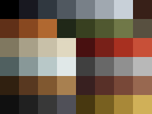

# Style Bible

Everything in this kit obeys the numbers below. The premium feel of a PSX-era
bundle does not come from detail - there is no room for detail at 64x64. It
comes from every prop looking like it was made for the *same game*.

## Hard constraints

| Rule | Value | Why |
|---|---|---|
| Triangle budget | 120-500 tris per prop | PS1 pushed ~180k tris/sec total |
| Texture size | 256x256, or 256x512 for tall props | ~1mm per texel at prop scale |
| Palette | fixed 32-colour CLUT | see `palette.png` |
| Colour depth | 15-bit, every channel a multiple of 8 | PS1 framebuffer was 5 bits/channel |
| Dither | ordered Bayer 4x4, strength 20 | the single strongest era cue |
| Filtering | `Closest` / point sampling, no mipmaps | bilinear instantly kills the look |
| Shading | flat faces, roughness 1.0, specular 0, metallic 0 | no PBR anywhere |
| Texel density | ~970-1101 px/m, square texels on every prop | non-square texels are the #1 tell of an amateur asset |
| Scale | real-world metres | can 102mm, bottle 300mm, pack 88mm |
| Pivot | base centre, +Z up | drops onto a floor without fixup |

## Density tiers

One density for the whole bundle does not survive contact with a 1.85m locker:
it would need a 1024 atlas no PS1 ever had. Two tiers, 3:1 apart:

| Tier | Density | Used for |
|---|---|---|
| `prop` | 551 px/m | handheld, under ~0.35m |
| `furniture` | 184 px/m | everything larger |

The ratio is not arbitrary. A 1.85m locker seen across a room covers roughly
340 screen pixels, so 184 px/m lands near 1:1 on screen; at the handheld
density it would carry 500 texels nobody ever resolves. The rule is **square
texels within a prop, constant density within a tier** - not one number for the
whole bundle.

## Material grain is measured in metres

Sizing noise off the face is a trap: a 1.85m locker gets 37px blocks and a
0.15m tin gets 3px ones, so the same painter produces two different materials.
`surfaces.GRAIN_M` fixes grain at 45/22/10mm and converts to pixels using the
prop's density. Steel then looks like steel whatever it is wrapped around.

## Atlas packing

Faces are packed automatically (`kit.skyline_pack`) at the tier density, into
the smallest atlas from a list that includes rectangular sizes. Shelf packing
wasted about a third of the sheet - one tall item such as a barrel's wrap band
set a shelf height everything after it had to clear.

Packing is deterministic, sorted tallest-first with ties broken by name, so the
texture baker and the Blender mesh builder always agree on placement. This is
the same contract as `geometry.py` for the revolved props.

A face whose surface is `"hidden"` still exists in the mesh - a hole would break
shadow casting and any generated collider - but shares one 4px rect with every
other hidden face. On the couch that is the difference between a 1024 and a
512 sheet.

## Baked edge shading

Every painted face darkens its own border (`surfaces.edge_shade`). PS1-era art
baked ambient occlusion into the texture because there was no runtime
shadowing, and it is the single thing that stops a box composite reading as a
pile of untextured blocks.

## Architecture

Walls, floor and ceiling tile instead of packing an atlas, at **the same texel
density as the furniture tier**. A 512 tile covers 2.78m. The UV scale in
`blender_scene.build_room` is computed from the tile's world size, never typed
in - type it in and the wall silently drifts off the props' pixel size the
first time the room changes dimensions.

Value noise tiles for free: nearest-upscaled blocks have no continuity to
break. Drawn features do not, so cracks and stains are drawn nine times at
tile offsets (`arch.wrapped`).

Wear is a **modulation of the surface, not a shape on top of it**. The first
pass drew damp as filled triangles and dirt as filled circles, and the result
was polka dots. `texgen.blotch` thresholds anisotropic noise instead: stretched
vertically it runs down a wall like water, stretched horizontally it reads as
traffic polish on a floor.

Concrete is dark on purpose. A light wall bounces so much that three bulbs light
a room evenly, and the practicals stop reading as sources.

## Rendering

Cycles, GPU. Point-sampled textures survive a physically based renderer fine -
`Closest` interpolation is what keeps the texels the pipeline exists to place.

Two things learned the hard way:

- **A bulb inside a fixture is a bulb inside a sealed tin.** The lamp's glass
  is an opaque diffuse texture like everything else in the kit, so the first
  lit render came out black. The fixture has `visible_shadow = False` rather
  than a transmissive shader the rest of the kit does not use.
- **Aim cameras with a look-at vector, not typed Euler angles.** Inside a
  closed room a hand-written rotation is a guess, and the first frame rendered
  a wall.

## Naming

```
SM_<Category>_<Name>_<##>      mesh      SM_Bottle_Vodka_01
MI_SM_<Category>_<Name>_<##>   material  MI_SM_Bottle_Vodka_01
<name>_d.png                   diffuse   bottle_d.png
```

## Palette

32 colours in eight material ramps: `void`, `tin`, `rust`, `olive`, `paper`,
`red`, `glass`, `concrete`. Ramps run dark to light and are indexed by
`palette.ramp(name)`. Nothing in a texture may use a colour outside the CLUT -
`palette.quantise()` enforces this, and the module asserts 15-bit safety at
import time.



## Texture authoring rules

1. Author at full colour depth, quantise **last**. Hand-picking CLUT indices
   produces flat, lifeless texels.
2. Grime is not optional. Every surface gets an fbm multiply pass. Clean
   surfaces read as "untextured", not as "new".
3. Labels use **real type**, set with a real typeface and rendered one-bit.
   `d.fontmode = "1"` is the whole trick: PIL antialiases TTF by default, and
   those grey edge pixels quantise into mud against a 32-colour CLUT. One-bit
   rendering puts every glyph edge on a texel boundary.

   Two constraints keep it legible on a curved surface:

   - **Cap type at ~28% of the texture width.** A cylinder presents only about
     100 degrees of arc legibly; wider type wraps out of sight and reads as a
     truncated word however crisp the glyphs are.
   - **Size from the box, never a fixed point size** (`texgen.fit`), so a
     density change rescales the type with it.

   Brand names are invented, with numeric suffixes and generic product nouns.
   Real trademarks mean a rejected listing.

4. Noise octaves are **block sizes in pixels**, not a subdivision count. Scale
   them with the texture and keep the coarsest well under a tenth of the width -
   it carries the most amplitude and turns into damp-looking blotches otherwise.

5. Scuffs stay inside their own atlas band (`scratches(..., ybox=...)`). Glass
   flecks bleeding onto a paper label is exactly the sort of detail that reads
   as sloppy at close range.
4. One vertical specular column is what makes unlit glass read as glass - but
   only on a cylindrical section, never across a taper.

7. Clear glass is not tinted glass. Vodka ships in flint glass: the ramp runs
   from a shadowed teal-grey to near-white, and thickness reads as darkening
   rather than colour. Green is for beer and wine.

## Texel density: the rule that matters most

A texel must be square on the model. If it is not, the texture reads as smeared
no matter how good the artwork is - and on a revolved shape like a bottle it is
very easy to get badly wrong. The first version of this kit put 13:1 slivers on
the bottle neck, because the neck wrapped the full 128px width across its 8cm
circumference while getting only 8 texture rows for 6.6cm of height.

The fix is a single contract in `tools/geometry.py`:

- **V advances with arc length** along the profile, so a centimetre of surface
  always gets the same number of rows, whether it is neck or belly.
- **U spans `r / r_max`** of the texture width, so a narrow ring does not smear
  the full width across a small circumference.
- The atlas rectangles are then **computed from the geometry**, not placed by
  hand. `textures.py` paints into whatever rows `geometry.py` derives.

### The price: shear on tapers

Where the radius changes ring to ring, the U scale changes with it, so the quad
is a trapezoid in UV space. Any texture detail with horizontal variation there
gets sheared into a diagonal swirl. This is not a bug to fix - it is what
uniform density costs on a converging surface.

The rule is to **paint nothing directional across a taper**:

- `geometry.taper_spans()` returns the row ranges where the radius changes.
  Content there is flattened to its row mean, so the band is constant around
  the circumference. A rotationally symmetric band has nothing to shear, and it
  reads as smooth blown glass, which is what a shoulder actually is.
- `geometry.straight_spans()` returns the cylindrical sections. Vertical
  features - mould lines, specular columns - go only there.

Both are derived from the profile, never from a hand-named band. The first
attempt hand-picked the "shoulder" band and still smeared, because the largest
jump (U scale 0.31 to 0.62) sat inside the band named "neck".

### Poles need real discs

A pole fan mapped to a single texture row gives a flat, untextured cap. The
bottle's cap top and base get their own discs in the unused lower half of the
atlas (`BOTTLE_CAP_DISC`, `BOTTLE_BASE_DISC`), sized at their true texel radius.

Run the audit before shipping anything:

```bash
cd tools && python check_density.py
```

It fails if any face deviates more than 1.15 from square texels, or if the
per-prop densities drift more than 1.15 apart across the bundle. It is what
caught the cigarette pack's side faces being mapped to a square rectangle for
a 23x88mm surface.

## UV atlases

Each texture function in `tools/textures.py` documents its atlas rectangles in
its docstring, and reads the actual numbers from `tools/geometry.py`. Those
rectangles are a **contract** with `tools/blender_build.py`, which writes UVs
explicitly rather than calling smart-unwrap - automatic unwrapping scatters
islands and breaks the shared atlas.

Note: the module is named `geometry.py`, not `profile.py`. Python ships a
stdlib module called `profile`, and Blender had already imported it, so the
shadowing import silently resolved to the wrong module.

## Deliberate non-goals

- **No normal/roughness/metallic maps.** Diffuse only. PBR maps on a 64px
  texture are wasted bytes and break the aesthetic.
- **No LODs.** A 48-triangle can does not need one.
- **No affine texture warping baked in.** The signature PS1 texture wobble is a
  *renderer* effect. Bake it into the asset and it is wrong from every other
  angle. Ship clean UVs and let the buyer's PSX shader do it.
